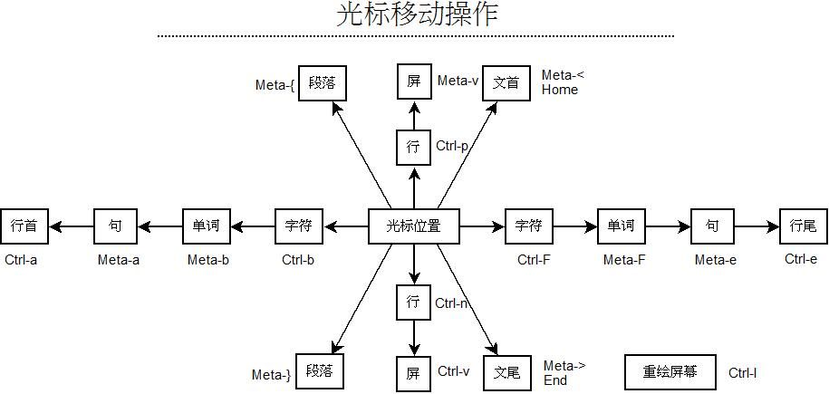
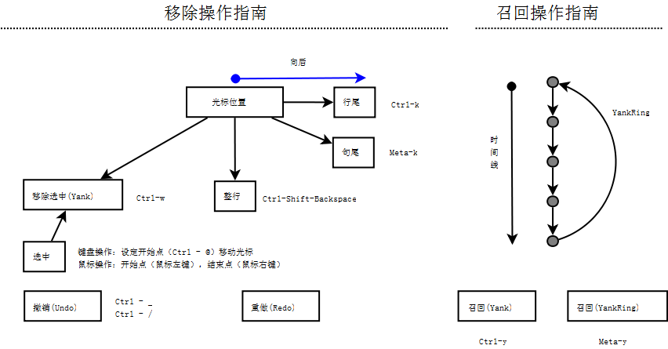
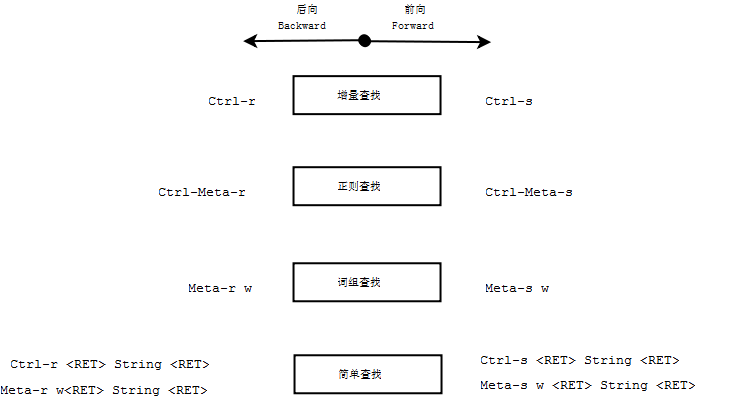

>[麦满屯: 3分钟学会Emacs基本操作](http://www.jianshu.com/p/90d2189750e7)

人们都说Emacs是神器，安装看看，这个神器确实够神：没有萌萌的图标，没有帅气的界面，没有性感的代码地图（SublimeText的mini map）。刚安装好的Emacs，就是一个呆到爆、土掉渣、傻到顶的“白痴”编辑器。

“就评这也能说是神器？在如今的编辑器大战中，Emacs也就是当作一个老古董任人凭吊了吧”。
好吧，其实刚刚装好的Emacs，就是一个刚刚初始的孩子，啥也不会，啥也不懂。都需要你亲手去调教呢。将来是一个小家碧玉，还是一个大家闺秀，抑或是一个女汉子，一切皆有可能啊。唯一可以确定的，如果你持之以恒的调整相关配置，未来一定可以得到一个为你量身定制的文本编辑器。而且，这个编辑器在Windows、Linux、Mac OSX、等主流浏览器上都有发行。

这也就是说，你会得到一个包打天下的神兵喔，是不是很吸引人？

我有心开一个Emacs的入门专题。在写这个专题的过程中，我也可以和大家一起学习，一起进步。

好吧，下面咱们言归正传，开始今天的话题。

# 1 序

Emacs以令人眼花缭乱的组合键“闻名于世”。要想使用好Emacs，死记硬背是不行的，多多的使用才是正途。然而，阅读Emacs使用手册、教程，有时会感到不够方便。因此各种各样的“CheatSheet”应运而生。简单的吧各种按键组合罗列起来，做“快速索引”我觉得还不够便捷。因此，我自己写了这篇文章，把我整理的“CheatSheet”写出来，作为积累保留以后检索使用。

# 2 Emacs中的基本文字编辑

Emacs是文本编辑器，虽然经过各位“牛人”的长期支持，Emacs已经在向“操作系统”演进，通过众多的“包”（Package），已经可以做到绝大多数你需要她完成的功能，所以Emacs中最基本的仍然是文字编辑功能。

使用Emacs编辑文本，主要涉及的功能包括：光标移动、删除文字、剪贴板的使用、Undo/Redo、文件操作等。下面我们一个个的来讲一讲。

Emacs中的光标移动
Eamcs中移动光标，和Windows操作系统中的绝大多数文本编辑器类似，可以使用“方向键”、“PageUP/PageDown”等按键完成。但是作为在“终端”时代生存至今的Emacs，还提供了让双手不离开键盘区，就可以移动光标的方法，而且在有的时候，这些组合按键的效率更高。

Emacs移动光标的组合键不少，我用下面这张图来说明。按图索骥，已经覆盖了Emacs原生的光标移动方法。

需要说明的是：在Emacs文档中，“Meta”键对应的是Windows键盘中的“Alt”键。

此外，Emacs移动到指定行的方法是：

M-g M-g：Emacs会要求输入行号，移动光标到指定行

# 3 Emacs中的删除

在Emacs删除文字有很多种方法。在说明相应的操作方法前，我们需要先弄明白几个概念：“删除（Delete）”、“移除（Kill）”、“召回（Yank）”还有“移除环（Kill-Ring）”

好吧，“删除”和“移除”在文本编辑的过程中实现的效果非常类似——对应的字符或内容在文档中“消失”了。存在细微差别的地方在与取回这些“消失”的内容的方法上：

被“删除”的内容，只能使用“撤销（Undo）”的办法来找回这些“消失的字符”。和大多数人预想的一样，这些“消失的字符”只会重新出现在原来它们所在的地方。关于Emacs的删除操作请看下图：

# 4 Emacs的剪贴板以及Undo/Redo

被“移除”的内容，除了可以使用“撤销”的方法了找回内容以外，还可以使用“召回”的方法让这些“消失”的内容出现在当前光标之后。这样的操作效果和使用了“剪贴板”的效果类似了。

“召回”，是将移除的内容插入到光标所在位置的一种操作。使用召回操作，让人有一种使用“剪贴板”的感觉。不过Emacs会记录多次“移除”操作的内容，这一点可要比windows操作系统提供的“剪贴板”功能要强大多了。这种记录多次“移除”操作内容的机制在Emacs中叫做“移除环”——Yank Ring。

“移除环”是Emacs存储移除内容的一种机制，其中含有多次“移除”操作的内容。之所以称其为“环”是因为在Emacs中提供了在光标位置插入不同“移除内容”的方法。而访问“移除内容”时是按照“环”的方式循环访问的。关于Emacs的移除操作和召回操作请见下图：

如果输入时错误的使用了“撤销”命令，而需要“撤销前面的撤销”操作，Emacs提供了“重做（Redo）”的方法：随便移动一下光标，在使用“撤销”命令 即可。

# 5 Emacs中的查找和替换

任何编辑器都有查找和替换的功能，Emacs也不例外。在Emacs中最常用的查找方法是“增量查找”。除此之外，Emacs还提供了“正则查找”、“词组查找”、“简单查找”三种方法。这些查找方法，一般来说，熟练掌握其中的一至两类就足够应付日常使用的需要了。

“增量查找”是“边输入边查找”的查找方式。也是在Emacs中使用最为频繁的一种查找方式。“正则查找”则是输入一个正则表达式来进行查找的方式。“词组查找”意味着输入的是一个词组（在英文等语言环境下，词组是有意义的。在中文环境下，应用的就少一些了）。“简单查找”和“增量查找”对应，是在用户输入完所有待查内容后才启动查找的方法。

几类查找的操作方法见下图：

有查找就有替换。在Emacs中，替换一般需要通过调用命令的方式实现。Emacs中提供的替换方式包括“全文替换”、“正则替换”、“交互式替换”三种方式。

其中“全文替换”和“正则替换”是从光标位置向后替换文字。“交互式替换”是在替换的过程中有控制的确定是否执行替换操作。

按Meta-% 即可启动查找且替换模式。

# 6 Emacs中的文件操作

基础的Emacs文件操作是创建、保存、另存。

- 创建新文件
	- 使用组合键 Ctrl-x Ctrl-f 打开“find file” 
	- 在提示符处输入一个不存在的文件名
	- 回车确认后，Emacs即创建了一个空的Buffer供输入使用。

- 保存文件
	- Emac的保存文件非常简单，只需要按下组合键Ctrl-x Ctrl-s即可。

- 另存文件
	- 要另存一个文件，按下组合键Ctrl-x Ctrl-w，按提示输入新的文件名即可。
