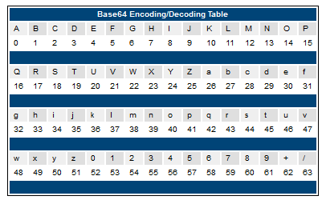

本文简单介绍下　base64 编码原理

Base64　编码过程：（base64　的编码都是按字符串长度）
1　首先以每　3　个　8bit　的字符为一组
2　然后针对每组，首先获取每个字符的　ASCII　编码
3　然后将　ASCII　编码转换成　8bit　的二进制，得到一组　3*8　=　24bit　的字节的二进制
4　然后再将这　24bit　划分为　4　个　6bit　的字节，并在每个　6bit　的字节前面都填两个高位　0　，得到　4　个　8bit　的字节
5　然后将这 4 个 8bit 的字节转换成 10 进制，对照 Base64 编码表 （下表），得到对应编码后的字符

**注意**：
- 要求被编码字符是 8bit 的，所以须在 ASCII 编码范围内，\u0000-\u00ff，中文就不行。
- 如果被编码字符长度不是 3 的倍数的时候，则都用 0 代替，对应的输出字符为 `=`



比如举下面2个例子：

a) 字符长度为能被 3 整除时：比如 "Tom" ：

```
字母:				T           o           m
ASCII:      84          111         109
8bit字节:   	01010100    01101111    01101101
6bit字节:		010101      000110      111101      101101
十进制:     	21          6           61          45
对应编码:   	V           G           9           t
```

```
new Buffer('Tom').toString('base64') = 'VG9t'
```

b) 字符串长度不能被 3 整除时，比如 "Lucy"：

```
字母:				L           u           c           y
ASCII:      76          117         99          121
8bit字节:   	01001100    01110101    01100011    01111001      00000000    00000000
6bit字节:   	010011      000111      010101      100011      	011110  		010000  		000000  		000000
十进制:     	19          7           21          35            30      		16      		(异常) 			(异常)      
对应编码:   	T           H           V           j             e       		Q       		=       		=
```

由于 Lucy 只有 4 个字母，所以按 3 个一组的话，第二组还有两个空位，所以需要用 0 来补齐。这里就需要注意，因为是需要补齐而出现的 0 ，所以转化成十进制的时候就不能按常规用 base64 编码表来对应，所以不是 a ， 可以理解成为一种特殊的“异常”，编码应该对应	`=`。

>
>参考资料：
>
>[关于 base64 编码的原理及实现](http://www.cnblogs.com/hongru/archive/2012/01/14/2321397.html)
>