title: Optimize image guide for web
speaker: 文桥
url: 
prismTheme: dark

<slide>
# web 图片优化指南
<div class="user">文桥　2017/08/28</div>

<slide>
# 1. 先介绍几个图片的基础知识

--------------
--------------
- [1.1 图像分类](/#slide=3)
- [1.2 图像基本数据结构](/#slide=4)
- [1.4 色彩空间(color space)](/#slide=5)
- [1.5 色彩模型(color model)](/#slide=6)
- [1.6 颜色深度(color depth)](/#slide=7)
- [1.7 图像模式(color modes)](/#slide=8)
--------------
--------------

<slide>
## 1.1 图像分类

### [位图（Raster graphics）](https://en.wikipedia.org/wiki/Raster_graphics){title="位图（Bitmap），又称栅格图或点阵图，是使用像素阵列(Pixel-array/Dot-matrix點陣)来表示的图像。"}

>In computer graphics, a raster graphics or bitmap image is a dot matrix data structure that represents a generally rectangular grid of pixels (points of color), viewable via a monitor, paper, or other display medium. Raster images are stored in image files with varying formats.

### [矢量图（Vector graphics）](https://en.wikipedia.org/wiki/Vector_graphics){title="矢量图形是计算机图形学中用点、直线或者多边形等基于数学方程的几何图元表示图像。"}

>Vector graphics are computer graphics images that are defined in terms of 2D points, which are connected by lines and curves to form polygons and other shapes. Each of these points has a definite position on the x- and y-axis of the work plane and determines the direction of the path; further, each path may have various properties including values for stroke color, shape, curve, thickness, and fill. Vector graphics are commonly found today in the SVG, EPS and PDF graphic file formats and are intrinsically different from the more common raster graphics file formats of JPEG, PNG, APNG, GIF, and MPEG4.

<slide>
## 1.2 图像基本数据结构

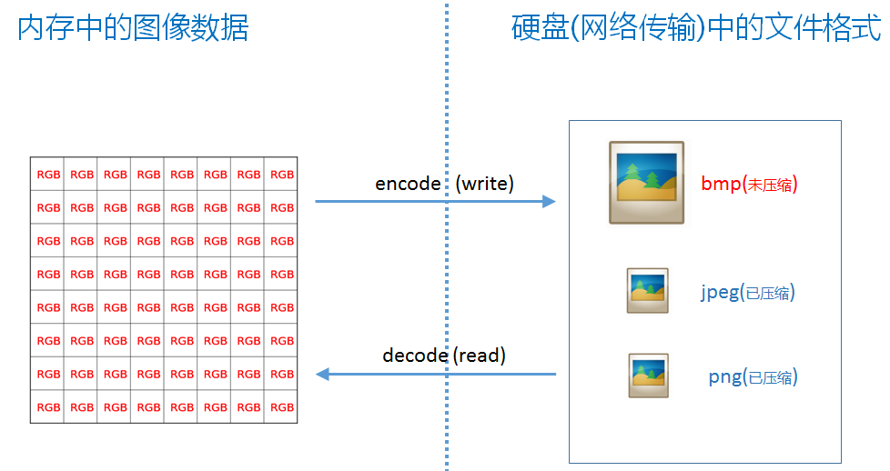{style="display: block; margin: 0 auto;"}

<slide>
## 1.3 [色彩空间(Color space)](https://en.wikipedia.org/wiki/Color_space){title="色彩空间是对色彩的组织方式。借助色彩空间和针对物理设备的测试，可以得到色彩的固定模拟和数字表示。色彩空间可以只通过任意挑选一些颜色来定义，比如像彩通系统就只是把一组特定的颜色作为样本，然后给每个颜色定义名字和代码；也可以是基于严谨的数学定义，比如 Adobe RGB、sRGB。"}

>A **color space** is a specific organization of colors.

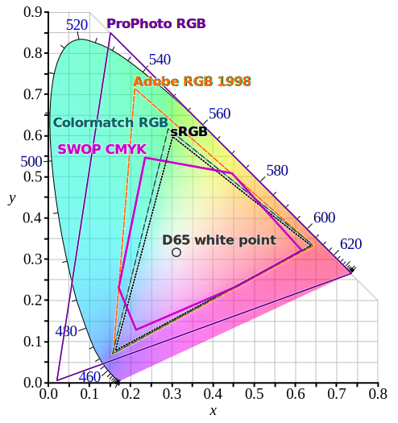{style="display: block; margin: 0 auto; width: 500px; height: 500px;"}


<slide>
## 1.5 [色彩模型(Color model)](https://en.wikipedia.org/wiki/Color_model){title="色彩模型是一种抽象数学模型，通过一组数字来描述颜色（例如RGB使用三元组、CMYK使用四元组）。如果一个色彩模型与绝对色彩空间没有映射关系，那么它多少都是与特定应用要求几乎没有关系的任意色彩系统。"}

>A **color model** is an abstract mathematical model describing the way colors can be represented as tuples of numbers, typically as three or four values or color components.

- [RGB](https://en.wikipedia.org/wiki/RGB_color_model){title="三原色光模式（RGB color model），又称RGB颜色模型或红绿蓝颜色模型，是一种加色模型，将红（Red）、绿（Green）、蓝（Blue）三原色的色光以不同的比例相加，以产生多种多样的色光。"}
- [YUV - luminance, Chrominance, Chroma](https://en.wikipedia.org/wiki/YUV){title="YUV，是一種顏色編碼方法。常使用在各個影像處理元件中。 YUV在對照片或影片編碼時，考慮到人類的感知能力，允許降低色度的頻寬。"}
- [CMYK(CMY) - cyan, magenta, yellow, key](https://en.wikipedia.org/wiki/CMYK_color_model){title="印刷四分色模式（CMYK）是彩色印刷时采用的一种套色模式，利用色料的三原色混色原理，加上黑色油墨，共計四种颜色混合疊加，形成所謂「全彩印刷」。四种标准颜色是：Cyan(青色)，Magenta(洋红色)，Yellow(黃色), Key Color(定位套版色)"}
- [HSL (hue, saturation, lightness) and HSV (hue, saturation, value)](https://en.wikipedia.org/wiki/HSL_and_HSV){title="HSL和HSV都是一种将RGB色彩模型中的点在圆柱坐标系中的表示法。这两种表示法试图做到比基于笛卡尔坐标系的几何结构RGB更加直观。HSL即色相、饱和度、亮度（Hue, Saturation, Lightness）。HSV即色相、饱和度、明度（Hue, Saturation, Value），又称HSB（Brightness）。"}
<br/>
<br/>
<br/>
<br/>

注：（1）色相（H）是色彩的基本属性，就是平常所说的颜色名称，如红色、黄色等。（2）饱和度（S）是指色彩的纯度，越高色彩越纯，低则逐渐变灰，取0-100%的数值。（3）明度（V），亮度（L），取0-100%。

<slide>
## 1.5 [颜色深度(color depth)](https://en.wikipedia.org/wiki/Color_depth)
<br/>
<br/>
<br/>
<br/>
>**Color depth** or **colour depth**, also known as **bit depth**, is either the number of bits used to indicate the color of a single pixel, in a bitmapped image or video framebuffer, or the number of bits used for each color component of a single pixel.

>位深度用于指定图像中的每个像素可以使用的颜色信息数量。每个像素使用的信息位数越多，可用的颜色就越多，颜色表现就更逼真。例如，位深度为 1 的图像的像素有两个可能的值：黑色和白色。位深度为 8 的图像有 2<sup>8</sup>（即 256）个可能的值。位深度为 8 的灰度模式图像有 256 个可能的灰色值。

<br/>
举个栗子：RGB 图像由三个颜色通道组成。8 位/像素的 RGB 图像中的每个通道有 256 个可能的值，这意味着该图像有 1600（256<sup>3</sup>） 万个以上可能的颜色值。有时将带有 8 位/通道 (bpc) 的 RGB 图像称作 24 位图像（8 位 x 3 通道 = 24 位数据/像素）。

<slide>
## 1.6 [图像模式(color modes)](https://helpx.adobe.com/cn/photoshop/using/color-modes.html)

>颜色模式或图像模式决定了如何基于颜色模式中的通道数量来组合颜色。不同的颜色模式会导致不同级别的颜色细节和不同的文件大小。

1. **[RGB 颜色模式](https://helpx.adobe.com/cn/photoshop/using/color-modes.html#rgb_color_mode)（数百万种颜色）**：Photoshop RGB 颜色模式使用 RGB 模型，并为每个像素分配一个强度值。在 8 位/通道的图像中，彩色图像中的每个 RGB（红色、绿色、蓝色）分量的强度值为 0（黑色）到 255（白色）。
2. **[CMYK 颜色模式](https://helpx.adobe.com/cn/photoshop/using/color-modes.html#cmyk_color_mode)（四种印刷色）**：在 CMYK 模式下，可以为每个像素的每种印刷油墨指定一个百分比值。为最亮（高光）颜色指定的印刷油墨颜色百分比较低；而为较暗（阴影）颜色指定的百分比较高。
3. **[索引颜色模式](https://helpx.adobe.com/cn/photoshop/using/color-modes.html#indexed_color_mode)（256 种颜色）**：索引颜色模式可生成最多 256 种颜色的 8 位图像文件。当转换为索引颜色时，Photoshop 将构建一个颜色查找表 (CLUT)，用以存放并索引图像中的颜色。如果原图像中的某种颜色没有出现在该表中，则程序将选取最接近的一种，或使用仿色以现有颜色来模拟该颜色。
4. **[灰度模式](https://helpx.adobe.com/cn/photoshop/using/color-modes.html#grayscale_mode)（8位，256 级灰度）**：灰度模式在图像中使用不同的灰度级。在 8 位图像中，最多有 256 级灰度。灰度图像中的每个像素都有一个 0（黑色）到 255（白色）之间的亮度值。
5. **[位图模式](https://helpx.adobe.com/cn/photoshop/using/color-modes.html#bitmap_mode)（1位，两种颜色）**：位图模式使用两种颜色值（黑色或白色）之一表示图像中的像素。位图模式下的图像被称为位映射 1 位图像，因为其位深度为 1。
6. **[Lab 颜色模式](https://helpx.adobe.com/cn/photoshop/using/color-modes.html#lab_color_mode)**：CIE L*a*b* 颜色模型 (Lab) 基于人对颜色的感觉。Lab 中的数值描述正常视力的人能够看到的所有颜色。因为 Lab 描述的是颜色的显示方式，而不是设备（如显示器、桌面打印机或数码相机）生成颜色所需的特定色料的数量，所以 Lab 被视为与设备无关的颜色模型。色彩管理系统使用 Lab 作为色标，将颜色从一个色彩空间转换到另一个色彩空间。
7. **[双色调模式](https://helpx.adobe.com/cn/photoshop/using/color-modes.html#duotone_mode)**：该模式通过一至四种自定油墨创建单色调、双色调（两种颜色）、三色调（三种颜色）和四色调（四种颜色）的灰度图像。
8. **[多通道模式](https://helpx.adobe.com/cn/photoshop/using/color-modes.html#multichannel_mode)**：多通道模式图像在每个通道中包含 256 个灰阶，对于特殊打印很有用。
-----------------------
注：多数图像模式都可以指定位通道数，通常为：8位/通道、16位/通道或32位/通道

<slide>
## 1.6 图像模式

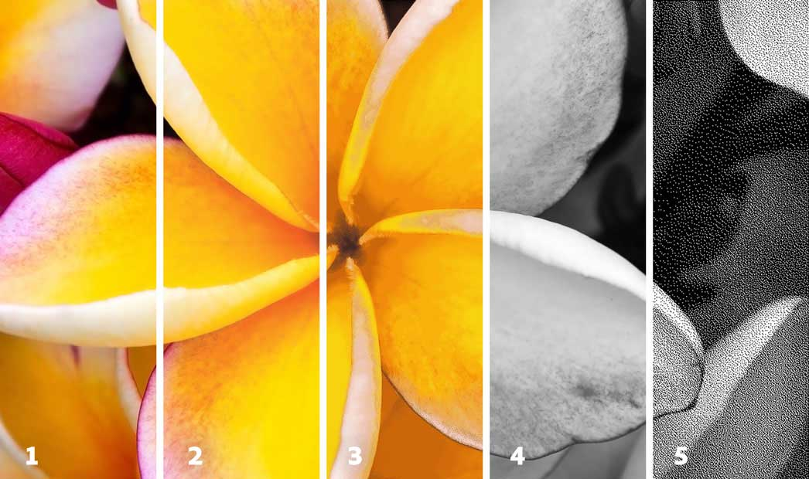{style="display: block; margin: 0 auto; width: 1046px; height: 620px;"}

<slide>
# 2. web 常见图片格式

|扩展名|文档类型|MIME Type|是否压缩编码|
|-----------|-----------|----------|-----------|
|[.bmp](https://en.wikipedia.org/wiki/BMP_file_format)|Windows OS/2 Bitmap Graphics|image/bmp|无压缩|
|[.gif](https://en.wikipedia.org/wiki/GIF)|Graphics Interchange Format (GIF)|image/gif|无损压缩|
|[.ico](https://en.wikipedia.org/wiki/ICO_(file_format))|Icon format|image/x-icon||
|[.jpeg<br/>.jpg](https://en.wikipedia.org/wiki/JPEG)|JPEG images|image/jpeg|有损压缩|
|[.png](https://en.wikipedia.org/wiki/Portable_Network_Graphics)|Portable Network Graphics|image/png|无损压缩|
|[.svg](https://en.wikipedia.org/wiki/Scalable_Vector_Graphics)|Scalable Vector Graphics (SVG)|image/svg+xml|无损压缩|
|[.tif<br/>.tiff](https://en.wikipedia.org/wiki/TIFF)|Tagged Image File Format (TIFF)|image/tiff|无损压缩|
|[.webp](https://developers.google.com/speed/webp/)|WEBP image|image/webp|有损压缩|

<slide>
## 2.2 [gif](https://en.wikipedia.org/wiki/GIF){title="Graphics Interchange Format"} 格式图片简介

The format supports up to 8 bits per pixel for each image, allowing a single image to reference its own palette of up to 256 different colors chosen from the 24-bit RGB color space. It also supports animations and allows a separate palette of up to 256 colors for each frame. These palette limitations make GIF less suitable for reproducing color photographs and other images with color gradients, but it is well-suited for simpler images such as graphics or logos with solid areas of color.

<div style="display: block; text-align: center;">
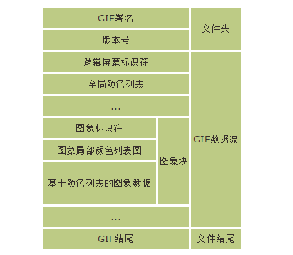{style="padding-right: 100px;"}
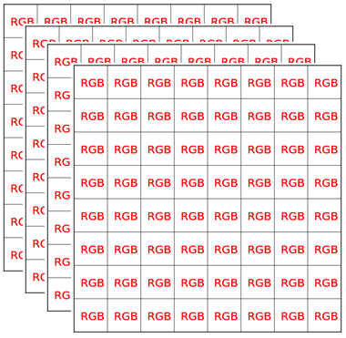{style="padding-left: 100px;"}
</div>

- [https://cloud.tencent.com/developer/article/1155421](https://cloud.tencent.com/developer/article/1155421)
- [https://blog.csdn.net/wzy198852/article/details/17266507](https://blog.csdn.net/wzy198852/article/details/17266507)

<slide>
## 2.3 jpeg 格式图片简介

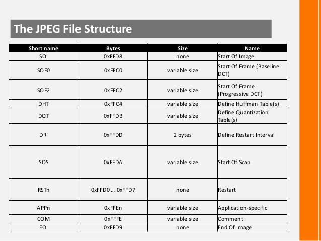{style="display: block; margin: 0 auto;"}

<slide>
### 2.3.1 jpeg 格式图片压缩原理简介
<br/>
<br/>
<br/>
<br/>
{style="display: block; margin: 0 auto;"}

<slide>
#### 2.3.1.1 Divided into 8*8 blocks
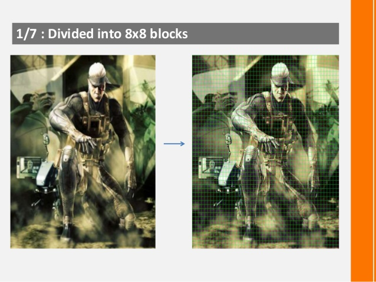{style="display: block; margin: 0 auto;", title="分块"}

<slide>
#### 2.3.1.1 Divided into 8*8 blocks

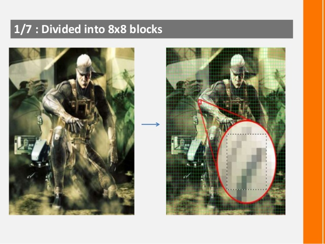{style="display: block; margin: 0 auto;", title="分块"}

<slide>
#### 2.3.1.2 Convert RGB to YCbCr

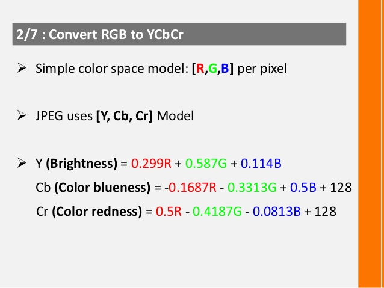{style="display: block; margin: 0 auto;", title="色彩空间转换"}

- [https://en.wikipedia.org/wiki/YCbCr#ITU-R_BT.601_conversion](https://en.wikipedia.org/wiki/YCbCr#ITU-R_BT.601_conversion)

<slide>
#### 2.3.1.2 Convert RGB to YCbCr

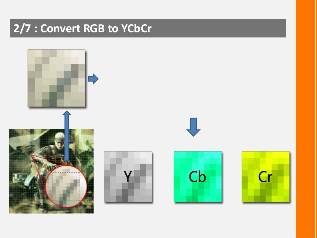{style="display: block; margin: 0 auto;", title="色彩空间转换"}

<slide>
#### 2.3.1.3 Downsampling(optional)

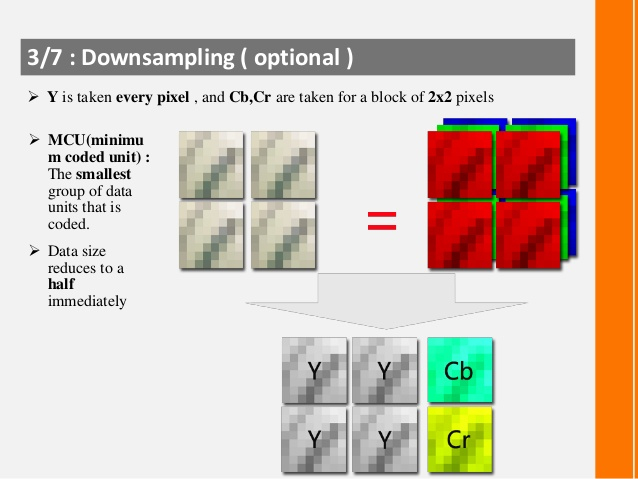{style="display: block; margin: 0 auto;", title="采样"}

<slide>
#### 2.3.1.4 Applay DCT[Discrete Cosine Transformation]

](./img/2019-03-14-optimize-image-guide-for-web/010.jpg){style="display: block; margin: 0 auto;", title="离散余弦变换"}

<slide>
#### 2.3.1.4 Applay DCT[Discrete Cosine Transformation]

](./img/2019-03-14-optimize-image-guide-for-web/011.jpg){style="display: block; margin: 0 auto;", title="离散余弦变换"}

<slide>
#### 2.3.1.5 Quantization

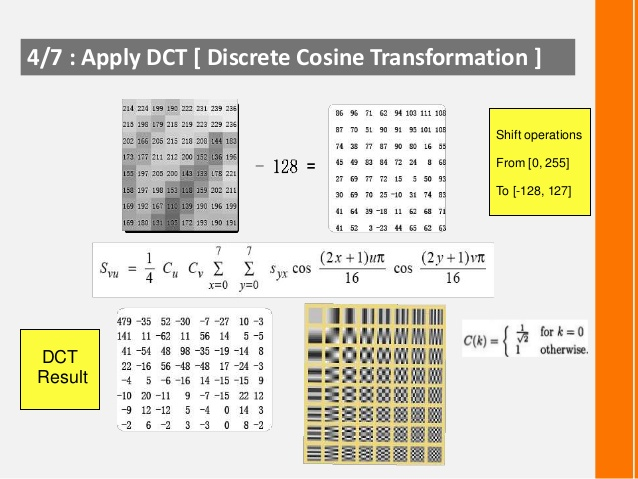{style="display: block; margin: 0 auto;", title="数据量子化"}

<slide>
#### 2.3.1.5 Quantization [Quality Factor]

![Quantization [Quality Factor]](./img/2019-03-14-optimize-image-guide-for-web/012.jpg){style="display: block; margin: 0 auto;", title="数据量子化"}

<slide>
#### 2.3.1.5 Quantization

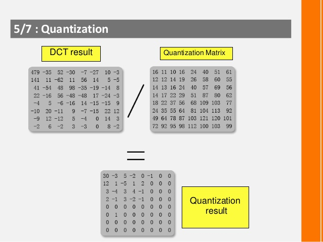{style="display: block; margin: 0 auto;", title="数据量子化"}

<slide>
#### 2.3.1.6 Zigzag reordering & RLE

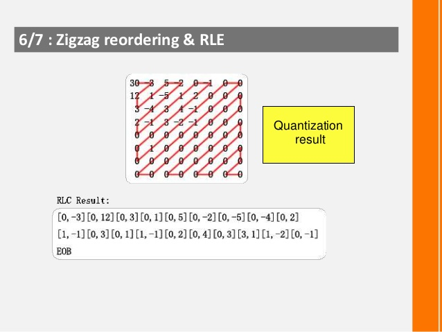{style="display: block; margin: 0 auto;", title="差值编码和Zig-zag扫描 & 游程长度编码(Run-Length Encoding, RLE)"}

<slide>
#### 2.3.1.7 Huffman encoding

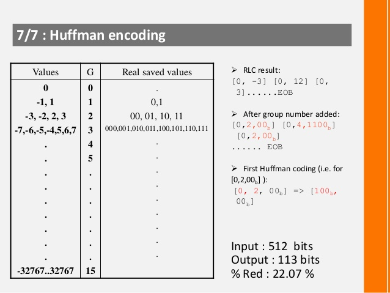{style="display: block; margin: 0 auto;", title="Huffman编码"}

<slide>
## 2.4 png 格式图片简介

|PNG文件标志|PNG数据块|.......|PNG数据块|
|-----------|-----------|----------|-----------|

|数据块符号|数据块名称|多数据块|可选否|位置限制|
|-----------|-----------|----------|-----------|-------------|
|IHDR|文件头数据块|否|否|第一块|
|cHRM	|基色和白色点数据块|	否|	是|	在PLTE和IDAT之前|
|gAMA	|图像γ数据块|	否|	是|	在PLTE和IDAT之前|
|sBIT	|样本有效位数据块|	否|	是	|在PLTE和IDAT之前|
|PLTE	|调色板数据块	|否	|是	|在IDAT之前|

- [https://blog.csdn.net/bisword/article/details/2777121](https://blog.csdn.net/bisword/article/details/2777121)

注：PNG定义了两种类型的数据块，一种是关键数据块(critical chunk)，这是标准的数据块，另一种叫做辅助数据块(ancillary chunks)，这是可选的数据块。

<slide>

|数据块符号|数据块名称|多数据块|可选否|位置限制|
|-----------|-----------|----------|-----------|-------------|
|bKGD	|背景颜色数据块	|否	|是|	在PLTE之后IDAT之前|
|hIST	|图像直方图数据块|	否|	是|	在PLTE之后IDAT之前|
|tRNS	|图像透明数据块	|否	|是	|在PLTE之后IDAT之前|
|oFFs	|(专用公共数据块)|	否|	是	|在IDAT之前|
|pHYs	|物理像素尺寸数据块	|否	|是	|在IDAT之前|
|sCAL	|(专用公共数据块)	|否|	是|	在IDAT之前|
|IDAT	|图像数据块	|是	|否	|与其他IDAT连续|
|tIME	|图像最后修改时间数据块|	否|	是|无限制|

<slide>

|数据块符号|数据块名称|多数据块|可选否|位置限制|
|-----------|-----------|----------|-----------|-------------|
|tEXt	|文本信息数据块|	是|	是|	无限制|
|zTXt	|压缩文本数据块	|是|	是|	无限制|
|fRAc	|(专用公共数据块)|	是|	是|	无限制|
|gIFg	|(专用公共数据块)|	是|	是|	无限制|
|gIFt	|(专用公共数据块)	|是|	是|	无限制|
|gIFx	|(专用公共数据块)	|是	|是	|无限制|
|IEND	|图像结束数据	|否|	否	|最后一个数据块|

<slide>
### 2.4.1 png 格式图片压缩原理简介
<br/>
<br/>
<br/>
<br/>
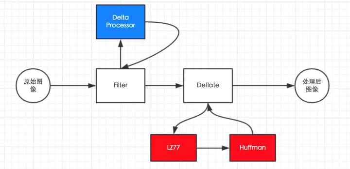{style="display: block; margin: 0 auto;"}

<slide>
### 2.4.1.1 Prediction
<br/>
<br/>
<br/>
<br/>
>在这一阶段，我们每次会处理图片中一行的数据，首先通过Filter阶段处理这一行当中每一个的像素点中每条通道的值，也就是我们常说的ARBG。它交由差分处理器来重新计算该通道的值。差分处理会根据这个像素点上通道和之前或者之上像素点对应通道值之间的差异，进行差分编码，也就是说，如果原本相邻像素点之间通道的值之间很接近，那么我们就会获得很多的1,0,-1这种很小的值。

```
[2,3,4,5,6,7,8] can become [2,1,1,1,1,1,1], where

[2, 3–2=1, 4–3=1, 5–4=1, 6–5=1, 7–6=1, 8–7=1]
```

注：差分编码器比较的是像素点之间对应通道的值，而并不是整个像素点。

<slide>
### 2.4.1.1 Compression
<br/>
<br/>
<br/>
<br/>
>在Prediction处理完毕之后，再将这一转换的结果输出给Deflate，Deflate执行真正的压缩操作，它会通过LZ77和Huffman对图像进行编码，最后将处理之后的结果保存。

<div style="display: block; text-align: center;" title="Deflate 每一行的匹配情况：前面我们分析过，整个处理过程是按行来处理的。而在处理每一行的数据时，Deflate把处理的符号数限制为3 ~ 258，也就是说，最大的压缩率为1032:1，当出现符号数小于3个时，那么就有可能出现无法匹配的情况，因此，对于图片宽度的改变将有可能影响最终压缩的效果。">
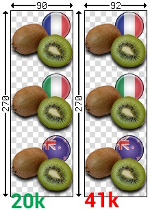{style="padding-right: 100px;"}
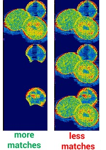{style="padding-left: 100px;"}
</div>

<slide> 
# 3. 那么优化图片我们到底能做什么
<br/>
<br/>
<br/>
<br/>
## 3.1 选择正确的图像格式

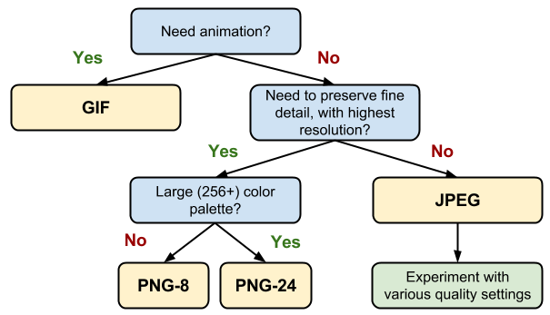{style="display: block; margin: 0 auto;"}

<slide>

>1. 您是否需要动画？如果需要，GIF 是唯一的通用选择。
>    - GIF 将调色板限制为最多 256 色，这对大多数图像而言都不是好的选择。 况且，对于调色板较小的图像，PNG-8 的压缩效果更佳。 因此，只有需要动画时，GIF 才是正确的选择。
>2. 您是否需要使用最高分辨率保留精细的细节？请使用 PNG。
>    - 除了选择调色板的大小外，PNG 不采用任何有损压缩算法。 因此，它能生成最高质量的图像，但代价是文件大小要比其他格式大得多。 请谨慎使用。
>    - 如果图像资产包含由几何形状组成的图像，请务必考虑将其转换成矢量 (SVG) 格式！
>    - 如果图像资产包含文本，请停下来再做考虑。 图像中的文本无法选择、搜索或“缩放”。 如果您需要表现一种自定义外观（出于品牌推广或其他原因），请改用网页字体。
>3. 您是否要优化照片、屏幕截图或类似的图像资产？请使用 JPEG。
>    - JPEG 组合使用有损和无损优化来减小图像资产的文件大小。 请尝试几种 JPEG 质量级别，为您的资产找到最佳的质量 与文件大小平衡点。

<slide> 
## 3.2 合理的压缩图片

- 避免使用有损编解码器重新压缩图像
- 减少不必要的图像解码及调整大小的成本

## 3.3 使用 CDN

<slide> 
## 3.4 使用内容类型协商

```html
<picture>
  <source srcset="/path/to/image.webp" type="image/webp">
  
</picture>
```

注：最好使用有优化图像功能的 CDN，自动返回最小尺寸的图片类型

## 3.5 使用 srcset 提供 HiDPI 图像

```html

```

```html
<picture>
  <source media="(min-width: 800px)" srcset="head.jpg, head-2x.jpg 2x">
  <source media="(min-width: 450px)" srcset="head-small.jpg, head-small-2x.jpg 2x">
  
</picture>
```

注：最好使用有优化图像功能的 CDN，自动返回最合适 HiDPI 的图片

<slide> 
## 3.6 延迟加载非关键图像

- [https://github.com/aFarkas/lazysizes](https://github.com/aFarkas/lazysizes)

## 3.7 缓存图像资产
## 3.8 预加载关键图像资产
## 3.9 测试图片优化的效果

- [https://webspeedtest.cloudinary.com/](https://webspeedtest.cloudinary.com/ )

注：只能检测 load 事件之前加载完成的图片。

<slide> 
## 3.10 Web performance budgets for images
<br/>
<br/>
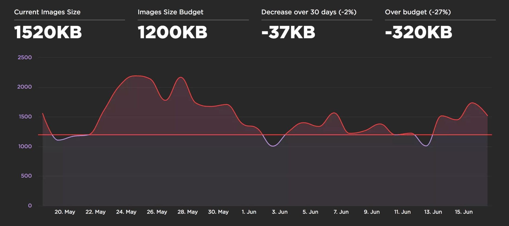{style="display: block; margin: 0 auto; width: 700px; height: 400px"}

- [https://calibreapp.com/docs/metrics/budgets](https://calibreapp.com/docs/metrics/budgets)
- [https://speedcurve.com/blog/tag/performance-budgets/](https://speedcurve.com/blog/tag/performance-budgets/)

<slide> 
# 4. Some Tools

- [https://tinyjpg.com/](https://tinyjpg.com/)
- [http://jpegclub.org/jpegtran/](http://jpegclub.org/jpegtran/)
- [https://github.com/kud/jpegrescan](https://github.com/kud/jpegrescan)
- [https://github.com/tjko/jpegoptim](https://github.com/tjko/jpegoptim)
- [https://github.com/mozilla/mozjpeg](https://github.com/mozilla/mozjpeg)
- [https://pngquant.org/](https://pngquant.org/)
- [https://tinypng.com/](https://tinypng.com/)
- [https://github.com/google/zopfli](https://github.com/google/zopfli)
- [https://github.com/pornel/giflossy](https://github.com/pornel/giflossy)

<slide>
- [https://github.com/svg/svgo](https://github.com/svg/svgo)
- [http://www.lcdf.org/gifsicle/](http://www.lcdf.org/gifsicle/)
- [http://jpegclub.org/jpegtran/](http://jpegclub.org/jpegtran/)
- [http://optipng.sourceforge.net/](http://optipng.sourceforge.net/)
- [http://pngquant.org/](http://pngquant.org/)
- [https://webspeedtest.cloudinary.com/](https://webspeedtest.cloudinary.com/)
- [https://github.com/apache/incubator-pagespeed-ngx](https://github.com/apache/incubator-pagespeed-ngx)
- [https://github.com/imazen/imageflow](https://github.com/imazen/imageflow)
- [https://github.com/thumbor/thumbor](https://github.com/thumbor/thumbor)
- [https://github.com/Klathmon/imagemin-webpack-plugin](https://github.com/Klathmon/imagemin-webpack-plugin)
- [https://github.com/imagemin/imagemin-guetzli](https://github.com/imagemin/imagemin-guetzli)
- [https://developers.google.com/speed/webp/docs/using](https://developers.google.com/speed/webp/docs/using)

<slide> 
# 5. References

- [https://www.cnblogs.com/buaaxhzh/p/9138307.html](https://www.cnblogs.com/buaaxhzh/p/9138307.html)
- [https://segmentfault.com/q/1010000000510683](https://segmentfault.com/q/1010000000510683)
- [https://medium.freecodecamp.org/how-jpg-works-a4dbd2316f35](https://medium.freecodecamp.org/how-jpg-works-a4dbd2316f35)
- [https://www.youtube.com/watch?v=Q2aEzeMDHMA](https://www.youtube.com/watch?v=Q2aEzeMDHMA)
- [http://dev.gameres.com/Program/Visual/Other/PNGFormat.htm](http://dev.gameres.com/Program/Visual/Other/PNGFormat.htm)
- [https://www.jianshu.com/p/5ad19825a3d0](https://www.jianshu.com/p/5ad19825a3d0)
- [https://medium.com/@duhroach/how-png-works-f1174e3cc7b7](https://medium.com/@duhroach/how-png-works-f1174e3cc7b7)
- [https://blog.csdn.net/wzy198852/article/details/17266507](https://blog.csdn.net/wzy198852/article/details/17266507)
- [https://www.jianshu.com/p/d4db7e0e028a](https://www.jianshu.com/p/d4db7e0e028a)
- [https://blog.csdn.net/Swallow_he/article/details/76165202](https://blog.csdn.net/Swallow_he/article/details/76165202)
- [https://cloud.tencent.com/developer/article/1155421](https://cloud.tencent.com/developer/article/1155421)
- [https://developers.google.com/speed/webp/](https://developers.google.com/speed/webp/)

<slide> 
- [https://medium.com/@duhroach/how-webp-works-lossly-mode-33bd2b1d0670](https://medium.com/@duhroach/how-webp-works-lossly-mode-33bd2b1d0670)
- [https://developers.google.com/web/fundamentals/performance/optimizing-content-efficiency/image-optimization](https://developers.google.com/web/fundamentals/performance/optimizing-content-efficiency/image-optimization)
- [https://developers.google.com/web/fundamentals/performance/optimizing-content-efficiency/automating-image-optimization/](https://developers.google.com/web/fundamentals/performance/optimizing-content-efficiency/automating-image-optimization/)
- [https://developers.google.com/web/updates/2015/09/automating-resource-selection-with-client-hints](https://developers.google.com/web/updates/2015/09/automating-resource-selection-with-client-hints)
- [https://www.smashingmagazine.com/2016/01/leaner-responsive-images-client-hints/](https://www.smashingmagazine.com/2016/01/leaner-responsive-images-client-hints/)
- [https://developers.google.com/web/fundamentals/performance/optimizing-content-efficiency/save-data/](https://developers.google.com/web/fundamentals/performance/optimizing-content-efficiency/save-data/)
- [https://developers.google.com/web/fundamentals/design-and-ux/responsive/images](https://developers.google.com/web/fundamentals/design-and-ux/responsive/images)
- [https://github.com/igrigorik/webp-detect](https://github.com/igrigorik/webp-detect)
- [https://developers.google.com/web/fundamentals/performance/optimizing-content-efficiency/replace-animated-gifs-with-video/](https://developers.google.com/web/fundamentals/performance/optimizing-content-efficiency/replace-animated-gifs-with-video/)
- [https://www.slideshare.net/PSJamwal10/image-compression-28886922](https://www.slideshare.net/PSJamwal10/image-compression-28886922)
- [http://shop.oreilly.com/product/0636920052036.do](http://shop.oreilly.com/product/0636920052036.do)

<slide> 
# 6. Thanks & FAQ

